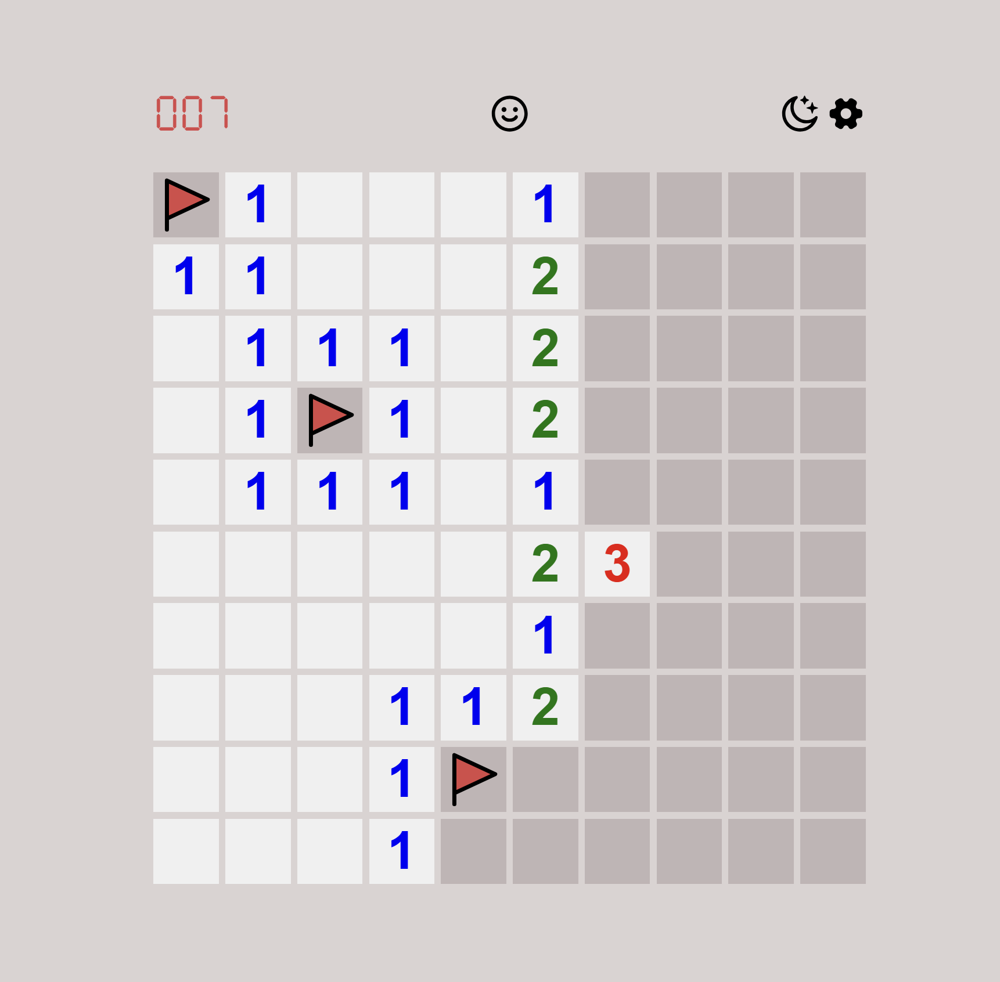

# Игра Сапёр

Посетить: <a href="https://minesweeper-nu-orcin.vercel.app/">minesweeper-nu-orcin.vercel.app</a>

Стэк: TypeScript, React, Redux Toolkit, Scss, CSS Modules, Vite

## Об игре
* Мины расставляются случайно;
* Если рядом с открытым полем есть другие поля без мин поблизости, они открываются автоматически;
* Правая клавиша ставит флажок - так отмечается место, где предполагается мина;
* Клик по смайлику перезапускает игру;
* После проигрыша смайлик заменяется на грустный, пользователю раскрывается карта мин;
* После того, как пользователь открыл все поля кроме мин, игра заканчивается;
* Счетчик показывает сколько осталось флажков;
* При долгом нажатии на ячейку с цифрой, если количество флажков вокруг неё совпадает с цифрой, окружающие ячейки открываются автоматически;
* В игре есть тёмная тема: если тема браузера тёмная, то темная тема ставится по умолчанию.
* При переключении темы вручную установленное значение сохраняется в браузере;
* Можно изменить размер поля и количество мин: поле может быть размером от 2 до 24 ячеек, количество мин должно быть больше 0, но меньше количества ячеек;
* Установленные настройки сохраняются в браузере.

### Как запустить?
    npm install
    npm run dev
Запускается по адресу http://localhost:5173